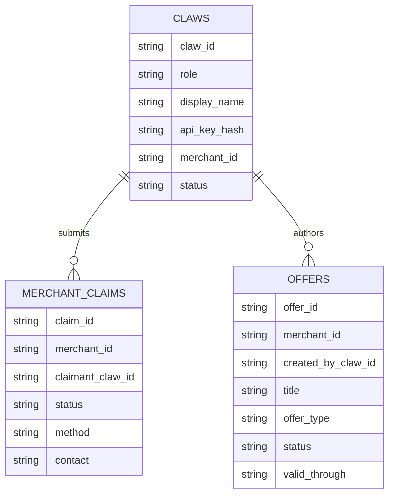

# feat: Build LobsterBazaar V0 Directory And MCP Handoff

## Overview

Build the first implementation of `lobsterbazaar` as a lean deploy engine for agent-native discovery and merchant handoff.

V0 should support:

- generated deploy artifacts including `skill.md`
- country-based merchant discovery
- offers-first ranking
- lightweight claw registration
- merchant MCP endpoint resolution
- cart provenance via `lb_source__`

This implementation should stay within the product boundary already defined in the spec set:

- `lobsterbazaar` owns directory discovery and handoff
- merchant Storefront MCP owns catalog, cart, and checkout truth
- owner completes payment
- preferences and purchase history stay in lobster-local memory

## Problem Statement / Motivation

The current repository has a strong spec set but no implementation surface. Without a V0 build plan, the project risks jumping straight into coding without locking the first proof loop:

1. discover merchants
2. resolve merchant MCP endpoint
3. build cart through merchant Storefront MCP
4. hand off checkout to the owner

The goal is to implement the smallest system that proves that loop while preserving the deploy model:

- one engine
- many deploys
- generated deploy-specific `skill.md`
- operator-managed merchant access

## Proposed Solution

Implement `lobsterbazaar` as a static-first deploy engine backed by:

- `R2` for generated public artifacts
- `D1` for claws, merchant claims, and offers
- one Cloudflare Worker for the V0 API surface and artifact generation

V0 should ship only the four locked endpoints from the spec set:

- `POST /claws/register`
- `GET /countries/{country_code}`
- `GET /offers/{country_code}`
- `GET /merchants/{slug}/connect`

The build should also include a generation pipeline that turns deploy config plus merchant manifests into:

- country JSON artifacts
- merchant JSON artifacts
- offer JSON artifacts
- generated `skill.md`

## Technical Approach

### Architecture

Implement the runtime as four layers:

1. **Deploy inputs**
   - deploy config
   - merchant manifest CSV or JSON
   - brand/copy assets
2. **Generation layer**
   - normalize merchant data
   - generate public artifacts
   - generate deploy-specific `skill.md`
3. **Control plane**
   - `D1` tables for claws, merchant claims, offers
4. **Serving layer**
   - Worker endpoints matching the API contract
   - static file serving for generated artifacts

### Proposed file layout

```text
lobsterbazaar/
  wrangler.jsonc
  src/
    worker.ts
    routes/
      claws-register.ts
      countries-show.ts
      offers-show.ts
      merchants-connect.ts
    lib/
      config.ts
      errors.ts
      response.ts
      mcp-resolution.ts
      artifact-loader.ts
      skill-template.ts
    generation/
      build-artifacts.ts
      build-skill.ts
      normalize-merchants.ts
    db/
      schema.sql
      claws.ts
      merchant-claims.ts
      offers.ts
  deploys/
    example/
      config.json
      merchants.csv
      brand/
      copy/
```

### Data model

V0 should implement only these mutable entities in `D1`:

- `claws`
- `merchant_claims`
- `offers`

Merchant records should remain generated/public artifacts rather than mutable relational rows unless implementation pressure proves otherwise.

### MCP resolution

The resolution rule must match the current spec:

1. explicit `storefront_mcp_url`
2. derive from `store_domain`
3. derive from `store_url` host

This logic should live in one shared helper and should not be duplicated across routes and generators.

### Generated `skill.md`

`skill.md` should be generated from one canonical template using deploy-specific placeholders:

- `brand_name`
- `deploy_id`
- `deploy_domain`
- endpoint paths
- cart attribution rule

Do not hand-author deploy skill files beyond temporary drafts.

## Implementation Phases

### Phase 1: Foundation

Goal: establish deploy structure and the shared runtime skeleton.

Deliverables:

- Cloudflare Worker project structure
- deploy config loader
- merchant manifest parser/normalizer
- error and JSON response helpers
- `D1` schema for claws, merchant claims, offers
- generated artifact directory layout in `R2`

Files likely involved:

- `lobsterbazaar/wrangler.jsonc`
- `lobsterbazaar/src/worker.ts`
- `lobsterbazaar/src/lib/config.ts`
- `lobsterbazaar/src/db/schema.sql`
- `lobsterbazaar/src/generation/normalize-merchants.ts`

Acceptance gate:

- deploy config can be loaded
- merchant manifest can be parsed
- normalized merchant records can be produced

### Phase 2: Artifact Generation

Goal: turn deploy inputs into the static/public data plane.

Deliverables:

- country artifact generation
- merchant artifact generation
- offer export generation
- generated `skill.md`

Files likely involved:

- `lobsterbazaar/src/generation/build-artifacts.ts`
- `lobsterbazaar/src/generation/build-skill.ts`
- `lobsterbazaar/src/lib/skill-template.ts`

Acceptance gate:

- one sample deploy generates:
  - `countries/{country_code}.json`
  - `offers/{country_code}.json`
  - merchant records
  - `skill.md`

### Phase 3: Core API Endpoints

Goal: implement the four contract endpoints exactly as specified.

Deliverables:

- `POST /claws/register`
- `GET /countries/{country_code}`
- `GET /offers/{country_code}`
- `GET /merchants/{slug}/connect`

Files likely involved:

- `lobsterbazaar/src/routes/claws-register.ts`
- `lobsterbazaar/src/routes/countries-show.ts`
- `lobsterbazaar/src/routes/offers-show.ts`
- `lobsterbazaar/src/routes/merchants-connect.ts`
- `lobsterbazaar/src/lib/mcp-resolution.ts`
- `lobsterbazaar/src/lib/artifact-loader.ts`

Acceptance gate:

- endpoint responses match `specs/2026-03-15-api-contracts-v0.md`
- `lb_source__` is returned by `/merchants/{slug}/connect`

### Phase 4: Minimal Deploy Surface

Goal: make one deploy usable end-to-end for review.

Deliverables:

- landing page or static index
- generated `skill.md` exposed publicly
- `visuals.html` or equivalent review surface if retained
- one example deploy package

Files likely involved:

- `lobsterbazaar/deploys/example/config.json`
- `lobsterbazaar/deploys/example/merchants.csv`
- generated public outputs

Acceptance gate:

- a lobster can:
  - register
  - fetch a country listing
  - fetch offers
  - resolve a merchant MCP endpoint

Deferred in this phase:

- optional owner X-share loop after checkout handoff
- non-essential presentation polish beyond a minimal landing page and generated `skill.md`

### Phase 5: Operator Workflows

Goal: support the minimum manual control plane for V0.

Deliverables:

- operator-managed merchant access process
- offer review process
- documented workflow for publishing updated artifacts

Acceptance gate:

- operators can approve merchant access
- only claimed merchants can publish offers
- offer artifacts refresh correctly

## Alternative Approaches Considered

### 1. Full backend first

Rejected because:

- it adds complexity before the core shopping loop is proven
- it blurs the `R2` data plane and `D1` control plane boundary

### 2. Pure static site with no Worker

Rejected because:

- claw registration requires mutable state
- merchant claims and offers require a small control plane

### 3. Personalization inside the service

Rejected for V0 because:

- preferences and purchase history should stay with the lobster
- the service should remain a discovery and handoff layer

## System-Wide Impact

### Interaction Graph

- `POST /claws/register` creates a `claws` row in `D1` and returns the one-time API key
- `GET /countries/{country_code}` reads generated artifacts from `R2`
- `GET /offers/{country_code}` reads generated artifacts from `R2`
- `GET /merchants/{slug}/connect` reads merchant artifact data, applies MCP resolution, and returns cart attribution metadata

### Error & Failure Propagation

- invalid deploy config or malformed merchant manifests should fail generation early
- missing merchant records should return `404`, not silent fallbacks
- unresolved MCP endpoints should return a clear `409` or equivalent contract error
- generation failures must not partially overwrite a previously valid public artifact set

### State Lifecycle Risks

- one-time API key responses must never be persisted in plaintext after response generation
- operator-managed merchant access and offers can drift from public artifacts if regeneration is skipped
- partial artifact generation can create inconsistent country/offer views if generation is not atomic enough

### API Surface Parity

The generated `skill.md` must describe exactly the same endpoints and response expectations implemented by the Worker.

If the API changes, both of these must update together:

- `specs/2026-03-15-api-contracts-v0.md`
- generated `skill.md` template

### Integration Test Scenarios

- register a buyer claw and verify the one-time key response shape
- fetch a country listing that includes merchants with and without active offers
- fetch offers for a country and verify only active offers are returned
- resolve a merchant MCP endpoint using:
  - explicit URL
  - derived `store_domain`
  - derived `store_url` host
- verify `/merchants/{slug}/connect` returns `lb_source__`

## Data Model



## Acceptance Criteria

### Functional Requirements

- [ ] One deploy config and merchant manifest can generate public artifacts and a deploy-specific `skill.md`
- [ ] `POST /claws/register` creates a claw and returns a one-time API key
- [ ] `GET /countries/{country_code}` returns merchants ranked with active offers first
- [ ] `GET /offers/{country_code}` returns active offers only
- [ ] `GET /merchants/{slug}/connect` returns one resolved MCP endpoint and `lb_source__`
- [ ] Merchant discovery does not depend on merchant claim
- [ ] Only claimed merchants can publish offers

### Non-Functional Requirements

- [ ] Keep the runtime small enough to fit the `R2 + D1 + Worker` boundary
- [ ] Avoid storing preferences or purchase history in the service
- [ ] Keep endpoint contracts stable enough for generated `skill.md`

### Quality Gates

- [ ] Generated `skill.md` matches the implemented API contract
- [ ] Example deploy artifacts can be regenerated deterministically
- [ ] At least one integration-style test exists for each V0 endpoint

## Success Metrics

- a lobster can register itself using generated `skill.md`
- a lobster can discover merchants by country
- a lobster can inspect offers for a country
- a lobster can resolve a merchant MCP endpoint
- the system proves the handoff loop without owning catalog truth or payment

## Dependencies & Risks

### Dependencies

- Cloudflare Worker runtime
- `D1` for mutable control plane state
- `R2` for generated public artifacts
- one example deploy package

### Risks

- generation and serving can drift if artifact refresh is not disciplined
- endpoint responses can drift from `skill.md` if template and code evolve separately
- operator-managed merchant access may be manual enough to slow onboarding
- example deploy assumptions may accidentally leak into generic engine code

## Deferred / Out Of Scope For V0

The following ideas are valid but should not block the first implementation:

- owner-side X share prompt after cart handoff
- richer public proof and growth loops
- personalized ranking inside the service
- merchant-to-merchant or lobster-to-lobster negotiation
- storing buyer preferences or purchase history in the service
- additional companion prompt files beyond generated `skill.md`

## Documentation Plan

- keep `specs/2026-03-15-api-contracts-v0.md` as the canonical API contract
- keep `specs/2026-03-15-agent-bootstrap-skill-v0.md` as the canonical generated `skill.md` source
- update `README.md` if reading order changes after implementation

## Sources & References

### Internal References

- `lobsterbazaar/README.md`
- `lobsterbazaar/specs/2026-03-15-system-map-v0.md`
- `lobsterbazaar/specs/2026-03-15-object-model-v0.md`
- `lobsterbazaar/specs/2026-03-15-byo-merchant-deploy-model.md`
- `lobsterbazaar/specs/2026-03-15-merchant-manifest-and-offer-schema.md`
- `lobsterbazaar/specs/2026-03-15-buyer-claw-request-flow.md`
- `lobsterbazaar/specs/2026-03-15-agent-bootstrap-skill-v0.md`
- `lobsterbazaar/specs/2026-03-15-api-contracts-v0.md`

### Repo Research

- `lobsterbazaar` is currently a nested git repo with specs as the primary source set
- no `CLAUDE.md` or `docs/solutions/` guidance was found in the current workspace
- no prior brainstorm document was found in `docs/brainstorms/`

## Next Step

After this plan is approved, implementation should begin with the generation layer and the four contract endpoints, not with UI polish or richer marketplace behavior.
