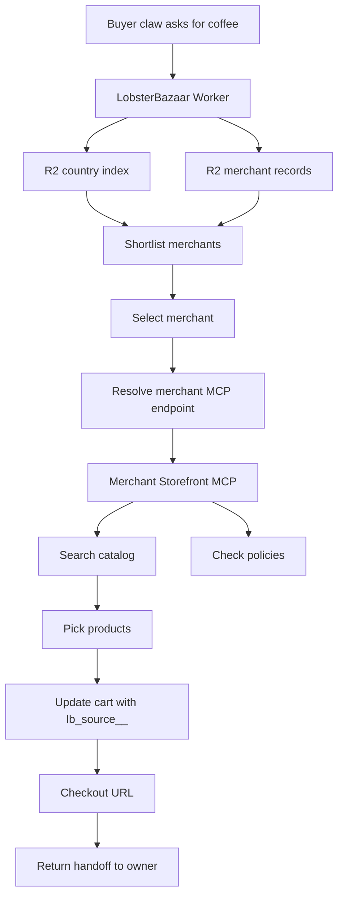
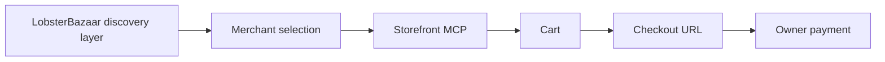

# Buyer Claw Request Flow

This document defines the core buyer-side flow that `lobsterbazaar` must prove before adding more marketplace intelligence.

## The loop to prove

1. shortlist merchants
2. resolve merchant Storefront MCP endpoint
3. build cart
4. hand off checkout

If this loop is weak, the rest does not matter.

## End-to-end flow



## Human-readable flow

```text
buyer claw
  -> asks for coffee in a country
  -> gets roaster shortlist + offers + notes
  -> picks a roaster
  -> resolves that roaster's MCP endpoint
  -> searches catalog
  -> builds cart
  -> returns checkout URL
  -> owner pays
```

## Step-by-step

### 1. Discovery request

Buyer claw asks something like:

- show good US roasters
- find a Colombian roaster with active offers
- pick a fruity filter coffee in the US

The engine should answer from:

- country index
- merchant records
- active offers

Not from a full catalog mirror.

### 2. Shortlist creation

The Worker returns:

- candidate merchants
- short notes
- active offers if relevant
- enough context for the claw to choose a merchant

The goal is not final product selection yet.
The goal is merchant selection.

### 3. Merchant selection

Buyer claw chooses a merchant based on:

- geography
- notes
- offers

The lobster can then apply its own local preferences and prior purchases before final product selection.

At this point the engine resolves:

- store URL
- the merchant MCP endpoint

### 4. Merchant MCP handoff

Now the claw moves from directory mode into merchant mode.

The claw asks the engine for the merchant connection, for example:

- `/merchants/{slug}/connect`

The engine returns one Storefront MCP endpoint for that merchant.

For V0, the claw uses the merchant’s Storefront MCP for:

- `search_shop_catalog`
- `search_shop_policies_and_faqs`
- `get_cart`
- `update_cart`

In practice this will usually be Shopify Storefront MCP.

This is where product truth lives.

### 5. Cart construction

The claw searches the merchant catalog, reasons about fit, and updates the cart.

When the cart is updated, the claw should attach a private cart attribute recording where the cart came from:

- key: `lb_source__`
- value: deploy ID such as `{deploy_id}`

This gives the merchant provenance without exposing the marker on the storefront.

The engine does not own:

- live price truth
- inventory truth
- cart truth

The merchant does.

### 6. Checkout handoff

The merchant MCP returns a cart state and checkout URL.

The claw returns:

- what it selected
- why it selected it
- the checkout URL

The owner then completes payment.

### 7. Optional owner share loop

After checkout handoff, the deploy may optionally offer a share action aimed at the owner.

This is for growth only.
It is not part of auth, merchant verification, or payment flow.

Recommended default line:

- `Human-approved, lobster-assembled.`

Example share text:

> My lobster just built my coffee cart at {merchant_name}. Human-approved, lobster-assembled. {deploy_domain}

The important part is that the share happens after a real successful cart handoff.

## Core boundary visual



## Engine responsibilities in this flow

- route by country
- surface merchant metadata
- surface active offers
- hand off to the correct Storefront MCP endpoint

## Merchant responsibilities in this flow

- expose catalog
- answer policy questions
- create/update cart
- provide checkout URL

## What can go wrong in the flow

### Discovery failure

Problem:

- shortlist is too broad
- shortlist is too narrow
- offers dominate too much

Mitigation:

- keep merchant notes good
- let offers rank first when present
- keep country routing simple first

### Merchant handoff failure

Problem:

- MCP endpoint missing
- MCP endpoint behaves unexpectedly

Mitigation:

- store endpoint explicitly when known
- otherwise derive it from `store_domain` or `store_url`
- return graceful fallback notes to the claw

### Cart mismatch

Problem:

- claw expects one thing
- merchant catalog reality is different

Mitigation:

- treat Storefront MCP as source of truth
- never treat directory metadata as product truth

## Recommended API surfaces for the flow

### Engine surfaces

- `/countries/{country_code}`
- `/merchants/{slug}`
- `/offers/{country_code}`
- `/merchants/{slug}/connect`

### Merchant surfaces

- `https://{shop-domain}/api/mcp`

## MCP resolution rule

The engine should be able to resolve many merchants, but each merchant only needs one MCP endpoint in V0.

Resolution order:

1. explicit `storefront_mcp_url`
2. derived from `store_domain`
3. derived from `store_url` host

## Checkout attribution rule

If a merchant asks where a cart came from, the answer should be visible in the cart attributes inside Shopify admin.

Recommended V0 marker:

```json
{
  "attributes": [
    {
      "key": "lb_source__",
      "value": "{deploy_id}"
    }
  ]
}
```

This uses Shopify's private cart attribute convention by ending the key with `__`.

## Example response shapes

### `/countries/us`

```json
{
  "country_code": "US",
  "merchants": [
    {
      "slug": "sample-roaster",
      "display_name": "Sample Roaster",
      "notes": "Known for fruity washed coffees.",
      "active_offers_count": 1
    }
  ]
}
```

### `/merchants/sample-roaster/connect`

```json
{
  "slug": "sample-roaster",
  "store_url": "https://sample-roaster.com",
  "storefront_mcp_url": "https://sample-roaster.myshopify.com/api/mcp",
  "notes": "Use merchant MCP for catalog, cart, and checkout."
}
```

## V0 recommendation

Do not optimize this flow prematurely.

V0 is good enough if:

- country-based discovery works
- merchant MCP handoff works
- the claw can build a cart
- owner receives a valid checkout URL

The owner share loop is optional and can be layered on after this works.

That is the loop to prove first.
