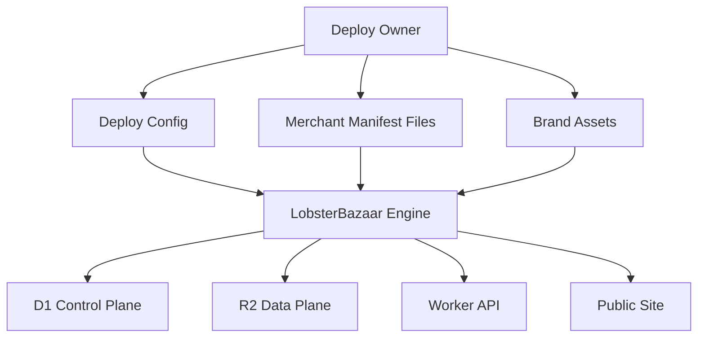

# Bring Your Own Merchants Deploy Model

This document defines how someone else should be able to deploy `lobsterbazaar` and bring their own merchants without editing engine code.

## Goal

Make deployment feel like:

- choose a domain
- choose a vertical
- provide merchant data
- configure branding
- deploy

Not:

- fork the codebase
- rewrite schemas
- hardcode merchant logic

## Core idea

One engine.
Many deploys.
Each deploy provides:

- a domain
- a vertical config
- merchant manifests
- optional offer policy
- branding
- merchant store domains or explicit MCP URLs
- a generated `skill.md`

## Deploy shape



## What varies per deploy

### Required deploy config

- `DEPLOY_ID`
- `DEPLOY_DOMAIN`
- `VERTICAL_ID`
- `VERTICAL_NAME`
- `DEFAULT_COUNTRIES`
- `BRAND_NAME`
- `BRAND_DESCRIPTION`

### Optional deploy config

- `CLAIM_MODE`
- `OFFERS_ENABLED`
- `PUBLIC_DIRECTORY`
- `SOCIAL_PROOF_ENABLED`
- `DEFAULT_LOCALE`

## Deploy package

The cleanest model is a deploy package with four inputs:

```text
deploy/
  config.json
  merchants.csv
  brand/
    logo.svg
    wordmark.svg
    og-image.png
  copy/
    home.md
    about.md
```

The engine should generate deploy-facing artifacts from this package, including:

- public pages
- machine-readable directory files
- deploy-specific `skill.md`

## Merchant onboarding mode

### Curated operator-managed onboarding

You import merchants from CSV or JSON yourself.
If a merchant wants to manage their entry, they contact you and you enable access after review.

Good for:

- curated launches
- quality control
- manually enabling merchant management

## Recommended V0 deploy workflow


## Deploy responsibilities

### Engine responsibilities

- validate deploy config
- ingest merchant manifests
- create D1 records
- generate R2 artifacts
- generate deploy-specific `skill.md`
- serve directory APIs
- handle operator-managed merchant access
- handle offer publishing

### Deploy owner responsibilities

- provide merchant data
- provide merchant store domains or explicit MCP URLs when known
- approve merchant access manually
- review offers
- maintain brand and copy
- decide which merchants stay visible

## Merchant portability requirement

Anyone bringing their own merchants should only need to supply:

- merchant manifest files
- optional `store_domain` or `storefront_mcp_url`
- optional claim contact info
- optional offer publishing permission

They should not need to:

- change object model
- edit Worker code
- edit route structure

## Storage namespacing

Even with separate deploys, use clear namespacing.

### D1

Each deploy should have its own database, or a clean deploy key in each table.

My preference:

- one D1 database per deploy

That keeps operational boundaries simple.

### R2

Each deploy should have a clean prefix or separate bucket.

My preference:

```text
/{deploy_id}/merchants/
/{deploy_id}/countries/
/{deploy_id}/offers/
```

## Public artifacts

Every deploy should expose the same public machine contract:

- merchant record JSON
- country listing JSON
- offer listing JSON
- markdown mirrors

The merchant record should carry enough information to derive one Storefront MCP endpoint per merchant.

That keeps claw behavior portable across deployments.

## Minimal deploy contract

If we want the smallest BYO merchant contract, standardize only these:

- deploy config file
- merchant manifest schema
- offer schema
- operator-managed merchant access flow
- MCP endpoint resolution rule
- generated `skill.md` contract

That is enough.

## Suggested deploy config

```json
{
  "deploy_id": "{deploy_id}",
  "deploy_domain": "{deploy_domain}",
  "vertical_id": "{vertical_id}",
  "vertical_name": "{vertical_name}",
  "brand_name": "{brand_name}",
  "public_directory": true,
  "offers_enabled": true,
  "claim_mode": "operator_managed",
  "default_countries": ["US", "CA"]
}
```

## Risks

- letting deploy owners extend the schema too early
- making deployment depend on custom code edits
- mixing public data and mutable control state
- making merchant access or offer policy deploy-specific in code instead of config

## V0 recommendation

For V0, the deployment product should be:

- one codebase
- one Worker
- one D1 schema
- one R2 artifact layout
- one deploy config contract
- one merchant manifest schema

That is enough to let others bring their own merchants.
