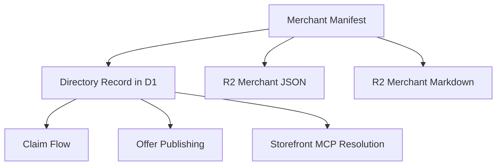
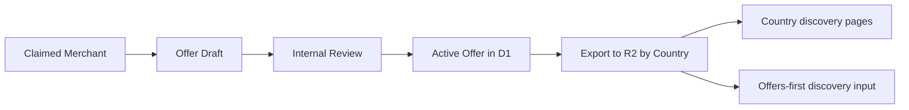

# Merchant Manifest And Offer Schema

This document defines the minimal schemas that other deploy operators should be able to use without editing engine code.

## Principle

Keep both schemas:

- small
- explicit
- stable
- generic enough for many verticals

## Merchant manifest

Merchant manifest is the import contract for directory records.

### Required fields

| Field | Type | Notes |
|---|---|---|
| `slug` | string | Stable URL-safe ID |
| `display_name` | string | Public name |
| `store_url` | string | Canonical merchant URL |
| `country_codes` | string[] | Discovery routing |
| `notes` | string | Short machine/human summary |

### Optional fields

| Field | Type | Notes |
|---|---|---|
| `store_domain` | string | Shopify domain if known |
| `storefront_mcp_url` | string | Full MCP endpoint if known |
| `locations_summary` | string | Example: `20+` |
| `tags` | string[] | Generic facets |
| `claim_contact` | string | Email or contact handle for operator review |
| `claim_status` | string | Usually imported as `unclaimed` |
| `vertical_metadata` | object | Vertical-specific extension block |

### JSON shape

```json
{
  "slug": "200-degs",
  "display_name": "200 Degrees Coffee",
  "store_url": "https://200degs.com",
  "store_domain": "200degs.myshopify.com",
  "storefront_mcp_url": "https://200degs.myshopify.com/api/mcp",
  "country_codes": ["GB"],
  "locations_summary": "20+",
  "notes": "Independent coffee company with more than twenty cafes in the UK.",
  "tags": ["coffee", "uk", "specialty"],
  "claim_status": "unclaimed",
  "vertical_metadata": {
    "category": "roaster"
  }
}
```

### CSV shape

```text
slug,display_name,store_url,store_domain,storefront_mcp_url,country_codes,locations_summary,notes,tags,claim_contact
200-degs,200 Degrees Coffee,https://200degs.com,200degs.myshopify.com,https://200degs.myshopify.com/api/mcp,"GB","20+","Independent coffee company with more than twenty cafes in the UK.","coffee|uk|specialty",hello@200degs.com
```

CSV stays intentionally simple for V0.
The MCP path shape is the same across merchants, so `store_domain` or `store_url` is usually enough.

## Merchant manifest visual



## Offer schema

Offer schema is the control-plane contract for merchant-authored incentives.

### Required fields

| Field | Type | Notes |
|---|---|---|
| `offer_id` | string | Stable offer ID for deterministic re-imports |
| `merchant_slug` | string | Owning merchant |
| `title` | string | Short offer title |
| `summary` | string | Short explanation |
| `country_codes` | string[] | Geo scope |
| `valid_through` | timestamp | Required expiry |
| `offer_type` | string | Structured type |
| `terms_text` | string | Human/claw-readable terms |

### Optional fields

| Field | Type | Notes |
|---|---|---|
| `active_from` | timestamp | Start date |
| `priority` | integer | Sorting hint |
| `public_proof_url` | string | Optional public proof |
| `offer_code` | string | If applicable |
| `vertical_metadata` | object | Vertical-specific extension block |

### JSON shape

```json
{
  "offer_id": "offer_200_degs_first_order",
  "merchant_slug": "200-degs",
  "title": "10% off first coffee order",
  "summary": "First-time buyers get 10% off selected coffees.",
  "country_codes": ["GB"],
  "active_from": "2026-03-15T00:00:00Z",
  "valid_through": "2026-04-15T23:59:59Z",
  "offer_type": "discount_code",
  "terms_text": "Valid for first order only. Excludes subscriptions.",
  "priority": 50,
  "public_proof_url": "https://x.com/example/status/123",
  "vertical_metadata": {
    "applies_to": "first_order"
  }
}
```

## Offer schema visual



## Vertical metadata rule

To keep the engine generic:

- common fields stay top-level
- vertical-specific fields go in `vertical_metadata`

Example for coffee:

```json
{
  "vertical_metadata": {
    "roaster_type": "specialty",
    "focus": ["filter", "light-roast"]
  }
}
```

That prevents schema lock-in while keeping deploys flexible.

## Validation rules

### Merchant manifest validation

- `slug` required and unique per deploy
- `store_url` required
- `country_codes` must contain at least one country
- `notes` required

### Offer validation

- merchant must exist
- merchant must be claimed
- `valid_through` required
- `country_codes` must contain at least one country
- expired offers must not become active

## MCP resolution rule

The service should resolve across many merchants, but each merchant only needs one MCP endpoint in V0.

Recommended Worker surface:

- `/merchants/{slug}/connect`

Resolution order:

1. use explicit `storefront_mcp_url` if present
2. otherwise derive from `store_domain` as `https://{store_domain}/api/mcp`
3. otherwise derive from the host in `store_url` as `https://{store_host}/api/mcp`

## Cart source attribution

When a claw builds a cart through the resolved merchant MCP, it should attach a private cart attribute recording the deploy source.

Recommended V0 convention:

```json
{
  "key": "lb_source__",
  "value": "{deploy_id}"
}
```

If a deploy-specific value is unavailable, use `lobsterbazaar`.

## Exported public shapes

### Merchant public artifact

```json
{
  "slug": "200-degs",
  "display_name": "200 Degrees Coffee",
  "store_url": "https://200degs.com",
  "country_codes": ["GB"],
  "notes": "Independent coffee company with more than twenty cafes in the UK.",
  "storefront_mcp_url": "https://200degs.myshopify.com/api/mcp",
  "claim_status": "unclaimed",
  "active_offers_count": 1
}
```

### Offer public artifact

```json
{
  "offer_id": "offer_xxx",
  "merchant_slug": "200-degs",
  "title": "10% off first coffee order",
  "summary": "First-time buyers get 10% off selected coffees.",
  "country_codes": ["GB"],
  "valid_through": "2026-04-15T23:59:59Z",
  "offer_type": "discount_code"
}
```

## Recommendation

Standardize these schemas early and keep them boring.

That will do more for portability than adding more engine features.
