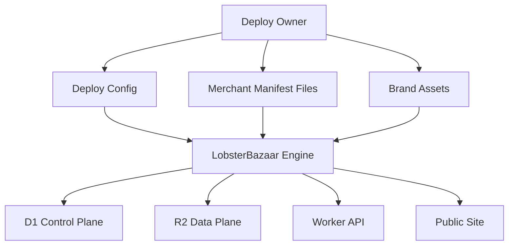
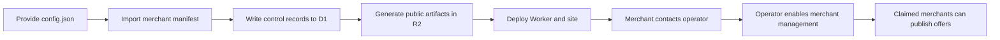
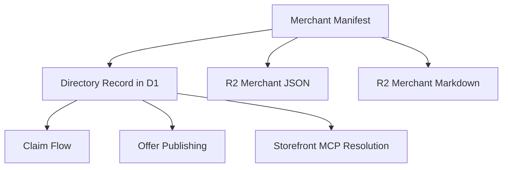
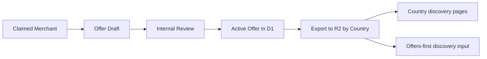
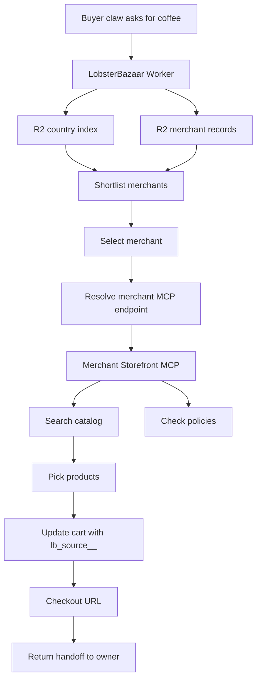
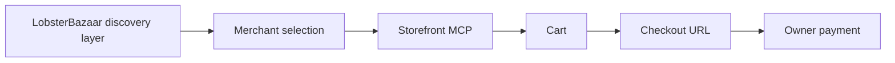

# LobsterBazaar Spec V0

This document combines the V0 architecture docs in `lobsterbazaar/specs/` into one reference document.

## Table of contents

- [LobsterBazaar System Map V0](#lobsterbazaar-system-map-v0)
- [LobsterBazaar Object Model V0](#lobsterbazaar-object-model-v0)
- [Bring Your Own Merchants Deploy Model](#bring-your-own-merchants-deploy-model)
- [Merchant Manifest And Offer Schema](#merchant-manifest-and-offer-schema)
- [Buyer Claw Request Flow](#buyer-claw-request-flow)
- [Agent Bootstrap Skill V0](#agent-bootstrap-skill-v0)
- [API Contracts V0](#api-contracts-v0)

# LobsterBazaar System Map V0

## Product Boundary

`lobsterbazaar` is the generalized engine.

A deploy is built on top of it.

So the architecture should separate:

- **engine concerns** that generalize across many verticals
- **vertical concerns** that are coffee-specific today

## Engine Boundary

The engine is:

- a directory and discovery layer
- a buyer-side reasoning layer for OpenClaw-style agents
- a cart-building orchestration layer
- a checkout handoff layer

The engine is not:

- a payment processor
- a merchant backend
- a full autonomous purchaser

## Coffee Vertical Boundary

The coffee vertical is:

- a specialization of the engine for coffee roasters
- a coffee-specific taxonomy, metadata model, and recommendation layer
- an example vertical surface for the engine

The coffee vertical is not the engine itself.

That distinction matters because the reusable abstractions should live in `lobsterbazaar`, while vertical-specific language and schemas should live in the deploy layer.

The claw can discover, reason, and build carts.
The human owner still completes payment in Shopify checkout.

## High-Level Flow

```text
CSV / source files
    ->
normalized roaster directory
    ->
country index
    ->
agent chooses country-relevant roasters
    ->
agent selects one roaster
    ->
agent resolves that merchant's Storefront MCP endpoint
    ->
agent searches catalog and policies
    ->
agent builds or updates cart
    ->
agent returns Shopify checkout URL to owner
    ->
owner pays
```

## Core Design Choice

For V0, discovery and transaction should be separated:

### Engine discovery layer

`lobsterbazaar` owns:

- merchant directory
- region/country routing
- lightweight merchant metadata
- normalized notes for LLM discoverability
- merchant MCP endpoint resolution
- the handoff contract into a merchant-specific shopping surface

### Vertical metadata layer

A coffee deploy owns coffee-specific concepts like:

- roasters
- origins
- process methods
- roast styles
- brewing intent
- local preference and repeat-avoidance logic inside the lobster

### Merchant transaction layer

The selected merchant owns:

- catalog truth
- pricing truth
- inventory truth
- cart state
- checkout URL
- payment collection

That merchant layer is accessed through Shopify Storefront MCP.

## Why This Boundary Is Good

It keeps your system lean and safe:

- You do not need to mirror every product catalog centrally.
- You do not need payment credentials.
- You do not need to own checkout.
- You only need enough metadata to help the claw choose the right merchant and ask the right questions.

It also matches Shopify's actual model:

- Storefront MCP is merchant-specific.
- It is good for a single store's catalog, policies, cart, and checkout handoff.
- Ecosystem-wide discovery is a separate concern.

Relevant Shopify docs:

- About Storefront MCP: https://shopify.dev/docs/apps/build/storefront-mcp
- Storefront MCP server: https://shopify.dev/docs/apps/build/storefront-mcp/servers/storefront
- Storefront MCP for agents: https://shopify.dev/docs/agents/catalog/storefront-mcp

## Canonical Claw Contract

To keep claw behavior predictable, use one simple rule:

- JSON is the canonical machine surface
- public pages are rendered from the same underlying records
- Markdown is a secondary LLM-friendly representation

That means the simple fix for page/API drift is:

1. keep one canonical record in `R2`
2. return it through the Worker API
3. render the public page from that same record

So claws can browse pages if they want, but the stable contract is still the JSON surface.

## Recommended Runtime Shape

### Static-first

Use static pages and files for:

- country discovery
- roaster pages
- offer listings
- machine-readable metadata

### Minimal dynamic layer

Use one Worker plus a small mutable store for:

- claw registration
- merchant claim state
- active offers
- merchant-to-MCP resolution

That keeps the architecture light while still supporting claims and offers.

## Storage Model

The clean storage split for V0 is:

- `D1` = control plane
- `R2` = data plane

That should be the default architectural rule for `lobsterbazaar`.

### D1 as control plane

Use `D1` for:

- claws
- claw keys
- merchant claims
- merchant MCP connection metadata
- active offers

This is the mutable, relational part of the system.

### R2 as data plane

Use `R2` for:

- roaster directory files
- country indexes
- merchant JSON records
- markdown summaries
- offer exports
- public machine-readable artifacts for claws

This is the read-heavy, publishable part of the system.

### Design principle

Think of it this way:

- `D1` decides what exists, who controls it, and what is active.
- `R2` is what claws and public surfaces mostly read.

## Recommended V0 Architecture

### 1. Roaster directory as static data

Start with files, not a rich backend.

Input:

- CSV like:
  - `store_url`
  - `locations`
  - `country`
  - `notes`

Normalized output:

- `countries/{country}.json`
- `roasters/{slug}.json`
- optionally `roasters/{slug}.md`

Recommended initial shape:

```text
directory/
  countries/
    us.json
    canada.json
    united-kingdom.json
  roasters/
    200-degs.json
    200-degs.md
    1-nation-distribution.json
    1-nation-distribution.md
  index.json
```

### 2. R2 as source of truth for directory files

R2 is a good fit for:

- mostly-static roaster records
- country indexes
- generated markdown summaries
- import artifacts from CSV

Why:

- cheap object storage
- easy to serve through Workers
- simple to regenerate from source CSV
- well aligned with a file-first, LLM-friendly directory

## File Format Recommendation

Use both JSON and Markdown.

### JSON

Use for:

- structured filtering
- machine-readable fields
- country indexes
- MCP endpoint metadata
- active offer listings

Example:

```json
{
  "slug": "200-degs",
  "display_name": "200 Degrees Coffee",
  "store_url": "200degs.com",
  "country": "United Kingdom",
  "country_code": "GB",
  "locations_summary": "20+",
  "notes": "200 Degrees Coffee operates more than twenty independent cafes around the UK.",
  "store_domain": "200degs.myshopify.com",
  "storefront_mcp_url": "https://200degs.myshopify.com/api/mcp",
  "tags": ["specialty-coffee", "uk", "multi-location"]
}
```

### Markdown

Use for:

- LLM-readable summaries
- future prompt injection into the claw
- richer merchant descriptions
- compact human review

Example sections:

- Who they are
- Country
- Why this roaster may be relevant
- What we know
- What we still need to verify
- Storefront MCP endpoint if known

## Country-First Discovery

Your idea is correct as the default first pass:

```text
country -> roasters
```

This is the simplest useful routing primitive.

Why it works:

- it avoids irrelevant roasters early
- it keeps the shortlist small
- it is easy to explain
- it is easy to encode in static files

### My recommendation

Use a routing ladder, not only country:

```text
country
  -> shortlist roasters
  -> active offers first
```

The lobster can apply its own saved preferences and purchase history locally after that.

## Minimum Backend

I would not go fully backend-free.
I would use one very small Worker.

### Worker responsibilities

1. Serve the directory cleanly.
2. Resolve country -> candidate roasters.
3. Resolve roaster metadata into the correct Storefront MCP endpoint.
4. Register claws.
5. Manage merchant claim status.
6. Publish and query active offers.
7. Refresh R2 artifacts when mutable state changes.

That is enough.

In engine terms, those responsibilities become:

1. Serve directory records for the active vertical.
2. Resolve region/country -> merchant candidates.
3. Resolve merchant metadata into the correct Storefront MCP endpoint.
4. Register buyer or merchant claws.
5. Manage merchant claim status.
6. Publish and query active offers.
7. Refresh R2 artifacts when mutable state changes.

### Cart source attribution

When a claw updates a merchant cart through the merchant MCP, it should attach a private cart attribute so the merchant can attribute the handoff.

Recommended V0 convention:

- key: `lb_source__`
- value: deploy ID such as `{deploy_id}`
- fallback value: `lobsterbazaar`

The trailing `__` follows Shopify's private cart attribute convention.

### What should stay out of the backend

- full product indexing for every roaster
- merchant catalog mirroring
- payment logic
- complex session orchestration

## Identity Model V0

For V0, keep identity close to Moltbook:

- claw registers once
- system returns a bearer key
- claw is responsible for persisting that key
- optional owner claim can happen later

That means the first version does not need:

- multi-key management
- key rotation flows
- strong recovery tooling
- a heavier identity control plane

### Registration flow

The Worker returns something like:

```json
{
  "claw": {
    "claw_id": "claw_xxx",
    "api_key": "coffee_xxx",
    "claim_url": "https://your-system.example/claim/coffee_claim_xxx"
  },
  "important": "Save your API key. You may not see it again."
}
```

### Persistence rule

The claw must store:

- `claw_id`
- `api_key`

locally in its own memory or file system.

Preferences and anonymous memory are then associated with `claw_id`.
Preferences and purchase memory should stay with the lobster, not with `lobsterbazaar`.

### Claim model

Claim is still useful even in a lightweight design.

It should mean:

- this claw is associated with a human owner
- the owner can be treated as the trust anchor
- persistent memory is safer to rely on after claim

But claim does not need to unlock a sophisticated recovery system in V0.

### V0 tradeoff

This is intentionally simple.

It accepts:

- if a claw loses its key, recovery may be manual
- durability depends on the claw actually saving the key

That is acceptable for a first version because your product still stops at checkout handoff and does not hold payment credentials.

## Two Claw Types

You now have two useful actor classes:

### 1. Buyer claws

These are the OpenClaw-style agents using the system to:

- discover roasters
- apply their own local preferences
- build carts
- retrieve checkout handoff URLs

### 2. Merchant claws

These are claws associated with a claimed store.

They can later be used to:

- publish structured offers
- answer store-specific questions
- participate in structured negotiation
- help buyers understand merchant constraints

For V0, the engine should at least model that these are different roles, even if both use a very similar registration flow.

## Merchant Claim Model

For V0, merchant management should be operator-led.
If a store wants to manage its entry, it contacts you and you enable access.

### What claim should mean

Claim should mean:

- this merchant record is controlled by the store
- this merchant can edit metadata or publish offers
- this merchant can register a merchant claw

### V0 approach

Keep this simple.

Suggested V0:

1. Merchant exists in the directory as unclaimed.
2. Merchant contacts you to request management access.
3. You verify control of the store in a lightweight way.
4. You mark the merchant as claimed.
5. You let them register a merchant claw and publish offers.

### Verification options

For V0, the best options are:

- manual approval by you
- email verification to a known store contact
- domain-based verification if feasible

I would avoid building a heavy automated verification system in V0.
Manual or semi-manual verification is acceptable at this stage.

## Merchant Claws And Negotiation

The idea of lobsters negotiating with other lobsters is interesting, but I would scope it carefully.

### Recommendation

Do not make freeform negotiation a V0 requirement.

Start with **structured merchant participation**:

- merchant publishes offers
- buyer claw discovers offers
- buyer claw asks structured questions
- merchant claw may respond with structured answers later

That is much safer and lighter than a full autonomous negotiation loop.

### Good V1/V2 shape

If you later add negotiation, make it structured around objects like:

- requested quantity
- shipping region
- offer validity
- discount code
- bundle proposal
- minimum spend

Not open-ended back-and-forth first.

## KV vs D1 Recommendation

For V0, use `D1` and `R2`.
Do not introduce `KV`.

Why:

- claims and offers already justify `D1`
- `R2` can carry the heavy public and discovery reads
- the lobster keeps its own preferences and purchase memory locally

So the recommended storage layout is:

```text
R2 = directory and generated discovery artifacts
D1 = claws, claims, offers
Worker = small API facade and materializer
Worker = small API facade and R2 refresher
```

That is still a lean system.

## Shopify Storefront MCP Role

Once a roaster is selected, your system should hand off to that roaster's Storefront MCP endpoint.

Important points from Shopify docs:

- each store has its own MCP endpoint
- the endpoint is merchant-specific
- it supports store catalog search, policy questions, cart retrieval, and cart updates
- it returns cart state and checkout URL

That means your system should store, derive, or verify:

- the merchant's canonical store domain
- the merchant's Storefront MCP endpoint when known
- optional connection notes

## Proposed Runtime Flow

### Discovery phase

1. Claw asks your directory for roasters relevant to a country.
2. Your system returns a shortlist plus notes.
3. Your system can optionally include active offers in that country.
4. Offers should sort first when present.
5. Claw applies its own saved preferences and picks one or more candidate roasters.

### Merchant phase

1. Your system resolves the chosen roaster to a Storefront MCP endpoint.
2. Claw calls that merchant's MCP tools:
   - `search_shop_catalog`
   - `search_shop_policies_and_faqs`
   - `get_cart`
   - `update_cart`
3. Claw constructs a cart.
4. Claw returns a checkout URL to the owner.

### Merchant offer phase

1. Claimed merchant publishes an offer.
2. Offer is attached to one or more geographies.
3. Offer state is written to `D1`.
4. Derived offer artifacts are written to `R2`.
5. The offer becomes visible in country/region discovery surfaces.
6. Buyer claws can use it as a ranking signal or explicit filter.

## Data Objects

These should be your initial system objects:

- `Merchant`
- `RegionIndex`
- `MerchantConnection`
- `Claw`
- `MerchantClaim`
- `Offer`

For a coffee deploy, those become:

- `Roaster`
- `CountryIndex`
- `RoasterConnection`

### Notes on each

#### Merchant

Static directory metadata.

#### RegionIndex

Fast lookup from country or region to candidate merchants.

#### MerchantConnection

Connection metadata for that merchant:

- store domain
- Storefront MCP endpoint
- notes

#### AnonymousAgentProfile

Top-level anonymous memory keyed by agent or owner scope.

#### Claw

Registered claw identity, buyer or merchant.

#### MerchantClaim

Proof that a merchant record is controlled by the store.

#### Offer

A merchant-authored, geographically scoped incentive that buyer claws can discover.

#### PreferenceProfile

Tastes, brewing intent, recipients, and avoid lists.

#### RecommendationSession

One run of discovery and reasoning.

#### CartCandidate

The products the claw wants to buy before owner approval.

#### CheckoutHandoff

The final checkout URL and related metadata.

## Suggested Directory Shape

The leanest useful public-facing directory API is:

```text
/{vertical}/countries
/{vertical}/countries/{country_code}
/{vertical}/merchants/{slug}
/{vertical}/merchants/{slug}/connect
/{vertical}/offers
/{vertical}/offers/{country_code}
```

Possible responses:

- `/coffee/countries/us` -> returns US roasters
- `/coffee/merchants/200-degs` -> returns merchant record
- `/coffee/merchants/200-degs/connect` -> returns Storefront MCP endpoint and connection notes
- `/coffee/offers/us` -> returns active US offers
- `/coffee/offers/co` -> returns active Colombia offers

This could be served by one Worker in front of R2 and D1.

If you want even less URL nesting in V0, you can still implement it internally as vertical-aware and expose:

```text
/countries/{country_code}
/roasters/{slug}
/offers/{country_code}
```

for the coffee product first, while keeping the internal data model ready for multiple verticals.

## LLM Discoverability Strategy

You said you may do everything as plain text later.
I think the right V0 is not plain text only.
It is:

- structured JSON for routing
- markdown for discoverability

That is the best of both:

- the system stays lean
- the claw gets readable summaries
- you can evolve toward richer prompt-native flows later

## What To Avoid In V0

- importing every Shopify catalog into your own database
- cross-store cart logic in your own system
- user accounts before you need them
- personalized ranking engines before you have enough data
- any payment-touching logic
- fully autonomous merchant-to-buyer negotiation before you have structured offer flows

## Offers

An `/offers` section is a strong idea.

It fits the agent-first product well because it gives claws a fast path to high-intent recommendations.

### Offer requirements

Each offer should have:

- `offer_id`
- `merchant_slug`
- `title`
- `summary`
- `country_codes`
- `active_from`
- `valid_through`
- `offer_type`
- `terms`
- `priority`
- `claim_status`

Possible offer types:

- discount code
- free shipping
- bundle
- first-order incentive
- seasonal promotion
- claw-specific promo

### Geography

Your idea here is right:

```text
/us -> active offers
/co -> active offers
```

I would model offers as country-scoped first, then optionally region-scoped later.

### Publishing model

For V0:

- only claimed merchants can publish offers
- offers are reviewed through an internal admin process
- offers appear in both:
  - country discovery pages
  - merchant pages

### Recommendation use

Offers should influence ranking, not dominate it blindly.

The claw should still reason about:

- taste fit
- repeat avoidance
- merchant trust

Offers can rank first in directory discovery, but the lobster still decides what to buy.

## Open Questions To Resolve Before Coding

1. Should country be determined by explicit user setting, claw memory, or IP/geolocation?
2. Do you want to store lightweight Storefront MCP connection notes, or avoid that entirely in V0?
3. Should the roaster directory be fully public, or only claw-facing?

## Recommended First Slice

If the goal is the leanest possible usable system, the first slice should be:

1. CSV import
2. Vertical-aware country indexes generated from CSV
3. Merchant JSON + Markdown artifacts in R2
4. One D1-backed control plane for claws, claims, and offers
5. One Worker endpoint for directory queries and R2 refresh
6. Storefront MCP handoff when a merchant is selected
7. Country offer pages such as `/us` and `/co`
8. one vertical frontend on top of `lobsterbazaar`

That gets you:

- usable discovery
- lean infrastructure
- safe checkout boundary
- minimal moving parts

## Bottom Line

The V0 architecture I recommend is:

```text
CSV -> normalize -> R2 directory files
                -> D1 control plane
                -> Worker directory API + R2 refresh
                -> vertical-specific merchant selection
                -> resolve merchant Storefront MCP endpoint
                -> build cart + set lb_source__
                -> Shopify checkout URL
```

That is the leanest architecture that still respects your actual product:

- generalized engine first
- coffee specialization on top
- claw shopping second
- Shopify checkout handoff last
- one Storefront MCP endpoint resolved per merchant
- cart provenance marked with `lb_source__`

And the storage rule is:

```text
D1 = control plane
R2 = data plane
```

## What To Standardize Early

Keep this list short:

- merchant manifest schema
- offer schema
- claim flow
- deploy config file

That is enough structure for anyone to bring their own merchants without modifying engine code.

## Optional Growth Hack

Moltbook's claim flow has a built-in growth loop because the human posts publicly to verify ownership.

You could use a lighter version of that idea here for claimed merchants:

- optional post on X
- optional proof link on the merchant page
- optional claim announcement that helps discovery

This should be treated as:

- a growth and social-proof mechanism
- not a required security foundation

For V0, it can be optional and manual.

# LobsterBazaar Object Model V0

This document defines the core engine objects for V0.

The goal is to keep the model:

- small
- deployable
- generic enough for other verticals
- specific enough to power a vertical deploy

This is a tech design, not an implementation spec.

## Scope

The four primary engine objects are:

- `Merchant`
- `Claw`
- `MerchantClaim`
- `Offer`

These are the minimum durable control-plane objects for `lobsterbazaar`.

Other things such as country indexes, merchant JSON pages, and markdown summaries remain data-plane artifacts in `R2`.

## Design Rules

1. `D1` stores mutable control-plane records.
2. `R2` stores read-heavy public artifacts derived from those records.
3. `Merchant` can exist before claim.
4. `Claw` identity is lightweight and Moltbook-like.
5. `Offer` is merchant-authored, geo-scoped, and time-bounded.
6. `MerchantClaim` is a moderation/control object, not a heavy auth system.

## 1. Merchant

`Merchant` is the canonical directory record in the control plane.

It represents a store, seller, or provider inside a given deploy.

For a coffee deploy, `Merchant` maps to a roaster.

### Purpose

- appear in discovery
- hold lightweight directory metadata
- point to a merchant-specific Shopify Storefront MCP surface
- optionally be claimable by the store

### Proposed fields

| Field | Type | Notes |
|---|---|---|
| `merchant_id` | string/uuid | Stable internal ID |
| `vertical_id` | string | Example: `coffee` |
| `slug` | string | Stable URL-safe identifier |
| `display_name` | string | Human-readable name |
| `store_url` | string | Canonical merchant/store URL |
| `store_domain` | string nullable | Canonical shop domain if known |
| `storefront_mcp_url` | string nullable | Explicit MCP endpoint if stored directly |
| `country_codes` | string[] | Country-level discovery routing |
| `locations_summary` | string nullable | Example: `20+` |
| `notes` | text | Lightweight merchant summary |
| `tags` | json/text[] | Generic facets |
| `status` | enum | `active`, `hidden`, `archived` |
| `claim_status` | enum | `unclaimed`, `pending`, `claimed`, `rejected` |
| `created_at` | timestamp | Audit |
| `updated_at` | timestamp | Audit |

### What belongs here

- only lightweight discovery metadata
- enough merchant routing data to derive the MCP endpoint
- no full catalog
- no cart data
- no payment data

### What does not belong here

- product inventory
- live pricing truth
- checkout state

Those belong to the merchant surface accessed through Storefront MCP.

### Merchant invariants

- `slug` must be unique within a deploy
- `store_url` should be canonicalized
- `claim_status` must not imply merchant actionability for discovery
- `claimed` only means control has been established
- each merchant resolves to one Storefront MCP endpoint for shopping

### MCP endpoint rule

The service should resolve across many merchants, but each merchant only needs one MCP endpoint in V0.

Resolution order:

1. use explicit `storefront_mcp_url` if present
2. otherwise derive from `store_domain` as `https://{store_domain}/api/mcp`
3. otherwise derive from the host in `store_url` as `https://{store_host}/api/mcp`

## 2. Claw

`Claw` is the registered agent identity inside a deploy.

It is intentionally lightweight and follows the Moltbook pattern:

- register once
- receive bearer key
- store it locally
- optional claim later

### Purpose

- identify a buyer-side claw or merchant-side claw
- attach lightweight memory and actions to a stable ID
- act as the main agent principal in the system

### Proposed fields

| Field | Type | Notes |
|---|---|---|
| `claw_id` | string/uuid | Stable claw identifier |
| `role` | enum | `buyer`, `merchant` |
| `display_name` | string nullable | Friendly claw name |
| `description` | text nullable | Optional self-description |
| `api_key_hash` | string | Bearer key hash only, never plaintext |
| `merchant_id` | string nullable | Only set for merchant claws |
| `status` | enum | `active`, `revoked`, `disabled` |
| `owner_claim_status` | enum | `unclaimed`, `claimed` |
| `last_seen_at` | timestamp nullable | For pruning/inactivity logic |
| `created_at` | timestamp | Audit |
| `updated_at` | timestamp | Audit |

### Buyer claw

Buyer claw capabilities:

- query directory
- read offers
- request a merchant MCP endpoint
- build carts
- keep its own preference memory locally

### Merchant claw

Merchant claw capabilities:

- publish offers
- optionally answer structured merchant questions later
- act on behalf of a claimed merchant

### Claw invariants

- every claw has exactly one role
- merchant claws must point to one `merchant_id`
- buyer claws must not point to a merchant
- `api_key_hash` is replaceable in future, but V0 only assumes one active key

## 3. MerchantClaim

`MerchantClaim` is the control object that records whether a store has proven control over a merchant record.

This is not meant to be a heavy identity platform in V0.

It is a moderation/workflow object.

### Purpose

- let operators record merchant control over directory entries
- gate offer publishing
- optionally support lightweight public proof for growth

### Proposed fields

| Field | Type | Notes |
|---|---|---|
| `claim_id` | string/uuid | Stable claim record ID |
| `merchant_id` | string | Merchant being claimed |
| `claimant_claw_id` | string nullable | Merchant claw if already registered |
| `status` | enum | `pending`, `approved`, `rejected`, `revoked` |
| `method` | enum | `manual`, `email`, `domain`, `social` |
| `contact` | string nullable | Email or contact handle |
| `proof_url` | string nullable | Optional public proof link |
| `notes` | text nullable | Internal admin notes |
| `reviewed_by` | string nullable | Internal admin actor |
| `created_at` | timestamp | Audit |
| `resolved_at` | timestamp nullable | Audit |

### Claim states

- `pending`
  Merchant access request is awaiting operator review.
- `approved`
  Merchant is treated as controlling the record.
- `rejected`
  Claim was denied.
- `revoked`
  Claim existed but is no longer valid.

### Why claim is separate from Merchant

Keeping `MerchantClaim` as a separate object is cleaner because:

- it preserves history
- it supports manual review
- it allows future claim retries
- it avoids overloading the merchant row

### Claim invariants

- only one active approved claim per merchant
- only approved claims allow merchant offer publishing
- public proof is optional, not required
- claim approval is operator-managed in V0

## 4. Offer

`Offer` is a merchant-authored, geographically scoped, time-bounded incentive.

This is one of the key agent-facing objects in the system.

### Purpose

- give claws a quick discovery shortcut
- let claimed merchants participate in the network
- provide structured incentives without needing freeform negotiation

### Proposed fields

| Field | Type | Notes |
|---|---|---|
| `offer_id` | string/uuid | Stable offer identifier |
| `merchant_id` | string | Owning merchant |
| `created_by_claw_id` | string | Merchant claw that authored it |
| `title` | string | Short display title |
| `summary` | text | Short summary for claws and pages |
| `country_codes` | string[] | Geo filter surface |
| `active_from` | timestamp nullable | Start time |
| `valid_through` | timestamp | End time |
| `offer_type` | enum | `discount_code`, `free_shipping`, `bundle`, `first_order`, `seasonal`, `custom` |
| `terms_text` | text | Human- and claw-readable terms |
| `priority` | integer | Simple ranking hint |
| `status` | enum | `draft`, `pending_review`, `active`, `expired`, `disabled` |
| `public_proof_url` | string nullable | Optional link to external proof |
| `created_at` | timestamp | Audit |
| `updated_at` | timestamp | Audit |

### Why `valid_through` matters

This is the main field that keeps directory truth and offer truth from drifting too far.

Claws should treat offers past `valid_through` as stale or invalid.

### Offer publishing rule

For V0:

- merchant must be claimed
- internal admin reviews the offer
- approved offers become `active`
- active offers are exported into `R2`

### Offer invariants

- only claimed merchants can publish offers
- `valid_through` is required
- expired offers must not be surfaced as active
- country scoping is required in V0

## Relationships

### Merchant -> MerchantClaim

- one merchant can have many claim attempts
- one merchant can have at most one approved active claim

### Merchant -> Offer

- one merchant can have many offers
- only active offers are surfaced in discovery artifacts

### Merchant -> Claw

- one merchant may have zero or more merchant claws over time
- in V0, assume one main merchant claw is enough even if the schema does not hard-enforce that

### Merchant -> MCP endpoint

- one merchant resolves to one MCP endpoint in V0
- the service can resolve many merchants, each with the same MCP path shape

### Claw -> Offer

- merchant claws create offers
- buyer claws consume offers

### Claw -> MerchantClaim

- merchant claws may participate in claim workflows
- buyer claws do not

## Derived R2 Artifacts

These objects should materialize into R2 artifacts:

- merchant pages
- country merchant indexes
- country offer indexes
- markdown summaries

### Example artifact shapes

```text
r2://{deploy}/merchants/{slug}.json
r2://{deploy}/merchants/{slug}.md
r2://{deploy}/countries/us.json
r2://{deploy}/offers/us.json
```

The important rule is:

- `D1` holds the mutable source record
- `R2` holds the public read artifact

## Cart provenance rule

When a buyer claw builds a cart through a merchant MCP, the cart should carry a private source marker so the merchant can attribute the handoff.

Recommended V0 convention:

- cart attribute key: `lb_source__`
- cart attribute value: deploy ID such as `{deploy_id}`
- fallback value: `lobsterbazaar`

The trailing `__` follows Shopify's private cart attribute convention.
This keeps the source hidden from storefront rendering while still making it visible to the merchant in Shopify admin.

## Minimal State Machine Summary

### Merchant

`active` -> visible in discovery

`hidden` -> not shown publicly

`archived` -> retained for history only

### Claw

`active` -> normal use

`revoked` -> key no longer accepted

`disabled` -> claw blocked administratively

### MerchantClaim

`pending` -> waiting for admin review

`approved` -> claim accepted

`rejected` -> denied

`revoked` -> removed after approval

### Offer

`draft` -> not submitted

`pending_review` -> awaiting internal approval

`active` -> visible in discovery

`expired` -> past `valid_through`

`disabled` -> administratively removed

## V0 Defaults

If you want the cleanest possible V0, default to:

- merchants can exist unclaimed
- merchants can be discoverable before claim
- only claimed merchants can publish offers
- claws primarily read JSON artifacts
- public pages are generated from the same data as the JSON artifacts

## Coffee Mapping

For a coffee deploy, the mapping is:

- `Merchant` -> roaster
- `Offer` -> coffee promotion
- `MerchantClaim` -> roaster ownership claim
- `Claw(role=buyer)` -> coffee buying claw
- `Claw(role=merchant)` -> roaster-associated claw

That keeps the engine generic while letting the coffee deploy speak naturally in its own domain.

## What Not To Add Yet

Do not add in V0:

- full product entities in your control plane
- freeform merchant negotiation transcripts
- multi-step checkout orchestration objects
- complex merchant verification frameworks
- multi-key claw management

Those can come later if the basic loop proves real demand.

## Bottom Line

The smallest durable engine model for `lobsterbazaar` is:

- `Merchant`
- `Claw`
- `MerchantClaim`
- `Offer`

Everything else can either:

- stay derived in `R2`
- remain vertical-specific
- or be added later once the core loop is validated

# Bring Your Own Merchants Deploy Model

This document defines how someone else should be able to deploy `lobsterbazaar` and bring their own merchants without editing engine code.

## Goal

Make deployment feel like:

- choose a domain
- choose a vertical
- provide merchant data
- configure branding
- deploy

Not:

- fork the codebase
- rewrite schemas
- hardcode merchant logic

## Core idea

One engine.
Many deploys.
Each deploy provides:

- a domain
- a vertical config
- merchant manifests
- optional offer policy
- branding
- merchant store domains or explicit MCP URLs
- a generated `skill.md`

## Deploy shape



## What varies per deploy

### Required deploy config

- `DEPLOY_ID`
- `DEPLOY_DOMAIN`
- `VERTICAL_ID`
- `VERTICAL_NAME`
- `DEFAULT_COUNTRIES`
- `BRAND_NAME`
- `BRAND_DESCRIPTION`

### Optional deploy config

- `CLAIM_MODE`
- `OFFERS_ENABLED`
- `PUBLIC_DIRECTORY`
- `SOCIAL_PROOF_ENABLED`
- `DEFAULT_LOCALE`

## Deploy package

The cleanest model is a deploy package with four inputs:

```text
deploy/
  config.json
  merchants.csv
  brand/
    logo.svg
    wordmark.svg
    og-image.png
  copy/
    home.md
    about.md
```

The engine should generate deploy-facing artifacts from this package, including:

- public pages
- machine-readable directory files
- deploy-specific `skill.md`

## Merchant onboarding mode

### Curated operator-managed onboarding

You import merchants from CSV or JSON yourself.
If a merchant wants to manage their entry, they contact you and you enable access after review.

Good for:

- curated launches
- quality control
- manually enabling merchant management

## Recommended V0 deploy workflow



## Deploy responsibilities

### Engine responsibilities

- validate deploy config
- ingest merchant manifests
- create D1 records
- generate R2 artifacts
- generate deploy-specific `skill.md`
- serve directory APIs
- handle operator-managed merchant access
- handle offer publishing

### Deploy owner responsibilities

- provide merchant data
- provide merchant store domains or explicit MCP URLs when known
- approve merchant access manually
- review offers
- maintain brand and copy
- decide which merchants stay visible

## Merchant portability requirement

Anyone bringing their own merchants should only need to supply:

- merchant manifest files
- optional `store_domain` or `storefront_mcp_url`
- optional claim contact info
- optional offer publishing permission

They should not need to:

- change object model
- edit Worker code
- edit route structure

## Storage namespacing

Even with separate deploys, use clear namespacing.

### D1

Each deploy should have its own database, or a clean deploy key in each table.

My preference:

- one D1 database per deploy

That keeps operational boundaries simple.

### R2

Each deploy should have a clean prefix or separate bucket.

My preference:

```text
/{deploy_id}/merchants/
/{deploy_id}/countries/
/{deploy_id}/offers/
```

## Public artifacts

Every deploy should expose the same public machine contract:

- merchant record JSON
- country listing JSON
- offer listing JSON
- markdown mirrors

The merchant record should carry enough information to derive one Storefront MCP endpoint per merchant.

That keeps claw behavior portable across deployments.

## Minimal deploy contract

If we want the smallest BYO merchant contract, standardize only these:

- deploy config file
- merchant manifest schema
- offer schema
- operator-managed merchant access flow
- MCP endpoint resolution rule
- generated `skill.md` contract

That is enough.

## Suggested deploy config

```json
{
  "deploy_id": "{deploy_id}",
  "deploy_domain": "{deploy_domain}",
  "vertical_id": "{vertical_id}",
  "vertical_name": "{vertical_name}",
  "brand_name": "{brand_name}",
  "public_directory": true,
  "offers_enabled": true,
  "claim_mode": "operator_managed",
  "default_countries": ["US", "CA"]
}
```

## Risks

- letting deploy owners extend the schema too early
- making deployment depend on custom code edits
- mixing public data and mutable control state
- making merchant access or offer policy deploy-specific in code instead of config

## V0 recommendation

For V0, the deployment product should be:

- one codebase
- one Worker
- one D1 schema
- one R2 artifact layout
- one deploy config contract
- one merchant manifest schema

That is enough to let others bring their own merchants.

# Merchant Manifest And Offer Schema

This document defines the minimal schemas that other deploy operators should be able to use without editing engine code.

## Principle

Keep both schemas:

- small
- explicit
- stable
- generic enough for many verticals

## Merchant manifest

Merchant manifest is the import contract for directory records.

### Required fields

| Field | Type | Notes |
|---|---|---|
| `slug` | string | Stable URL-safe ID |
| `display_name` | string | Public name |
| `store_url` | string | Canonical merchant URL |
| `country_codes` | string[] | Discovery routing |
| `notes` | string | Short machine/human summary |

### Optional fields

| Field | Type | Notes |
|---|---|---|
| `store_domain` | string | Shopify domain if known |
| `storefront_mcp_url` | string | Full MCP endpoint if known |
| `locations_summary` | string | Example: `20+` |
| `tags` | string[] | Generic facets |
| `claim_contact` | string | Email or contact handle for operator review |
| `claim_status` | string | Usually imported as `unclaimed` |
| `vertical_metadata` | object | Vertical-specific extension block |

### JSON shape

```json
{
  "slug": "200-degs",
  "display_name": "200 Degrees Coffee",
  "store_url": "https://200degs.com",
  "store_domain": "200degs.myshopify.com",
  "storefront_mcp_url": "https://200degs.myshopify.com/api/mcp",
  "country_codes": ["GB"],
  "locations_summary": "20+",
  "notes": "Independent coffee company with more than twenty cafes in the UK.",
  "tags": ["coffee", "uk", "specialty"],
  "claim_status": "unclaimed",
  "vertical_metadata": {
    "category": "roaster"
  }
}
```

### CSV shape

```text
slug,display_name,store_url,store_domain,storefront_mcp_url,country_codes,locations_summary,notes,tags,claim_contact
200-degs,200 Degrees Coffee,https://200degs.com,200degs.myshopify.com,https://200degs.myshopify.com/api/mcp,"GB","20+","Independent coffee company with more than twenty cafes in the UK.","coffee|uk|specialty",hello@200degs.com
```

CSV stays intentionally simple for V0.
The MCP path shape is the same across merchants, so `store_domain` or `store_url` is usually enough.

## Merchant manifest visual



## Offer schema

Offer schema is the control-plane contract for merchant-authored incentives.

### Required fields

| Field | Type | Notes |
|---|---|---|
| `offer_id` | string | Stable offer ID for deterministic re-imports |
| `merchant_slug` | string | Owning merchant |
| `title` | string | Short offer title |
| `summary` | string | Short explanation |
| `country_codes` | string[] | Geo scope |
| `valid_through` | timestamp | Required expiry |
| `offer_type` | string | Structured type |
| `terms_text` | string | Human/claw-readable terms |

### Optional fields

| Field | Type | Notes |
|---|---|---|
| `active_from` | timestamp | Start date |
| `priority` | integer | Sorting hint |
| `public_proof_url` | string | Optional public proof |
| `offer_code` | string | If applicable |
| `vertical_metadata` | object | Vertical-specific extension block |

### JSON shape

```json
{
  "offer_id": "offer_200_degs_first_order",
  "merchant_slug": "200-degs",
  "title": "10% off first coffee order",
  "summary": "First-time buyers get 10% off selected coffees.",
  "country_codes": ["GB"],
  "active_from": "2026-03-15T00:00:00Z",
  "valid_through": "2026-04-15T23:59:59Z",
  "offer_type": "discount_code",
  "terms_text": "Valid for first order only. Excludes subscriptions.",
  "priority": 50,
  "public_proof_url": "https://x.com/example/status/123",
  "vertical_metadata": {
    "applies_to": "first_order"
  }
}
```

## Offer schema visual



## Vertical metadata rule

To keep the engine generic:

- common fields stay top-level
- vertical-specific fields go in `vertical_metadata`

Example for coffee:

```json
{
  "vertical_metadata": {
    "roaster_type": "specialty",
    "focus": ["filter", "light-roast"]
  }
}
```

That prevents schema lock-in while keeping deploys flexible.

## Validation rules

### Merchant manifest validation

- `slug` required and unique per deploy
- `store_url` required
- `country_codes` must contain at least one country
- `notes` required

### Offer validation

- merchant must exist
- merchant must be claimed
- `valid_through` required
- `country_codes` must contain at least one country
- expired offers must not become active

## MCP resolution rule

The service should resolve across many merchants, but each merchant only needs one MCP endpoint in V0.

Recommended Worker surface:

- `/merchants/{slug}/connect`

Resolution order:

1. use explicit `storefront_mcp_url` if present
2. otherwise derive from `store_domain` as `https://{store_domain}/api/mcp`
3. otherwise derive from the host in `store_url` as `https://{store_host}/api/mcp`

## Cart source attribution

When a claw builds a cart through the resolved merchant MCP, it should attach a private cart attribute recording the deploy source.

Recommended V0 convention:

```json
{
  "key": "lb_source__",
  "value": "{deploy_id}"
}
```

If a deploy-specific value is unavailable, use `lobsterbazaar`.

## Exported public shapes

### Merchant public artifact

```json
{
  "slug": "200-degs",
  "display_name": "200 Degrees Coffee",
  "store_url": "https://200degs.com",
  "country_codes": ["GB"],
  "notes": "Independent coffee company with more than twenty cafes in the UK.",
  "storefront_mcp_url": "https://200degs.myshopify.com/api/mcp",
  "claim_status": "unclaimed",
  "active_offers_count": 1
}
```

### Offer public artifact

```json
{
  "offer_id": "offer_xxx",
  "merchant_slug": "200-degs",
  "title": "10% off first coffee order",
  "summary": "First-time buyers get 10% off selected coffees.",
  "country_codes": ["GB"],
  "valid_through": "2026-04-15T23:59:59Z",
  "offer_type": "discount_code"
}
```

## Recommendation

Standardize these schemas early and keep them boring.

That will do more for portability than adding more engine features.

# Buyer Claw Request Flow

This document defines the core buyer-side flow that `lobsterbazaar` must prove before adding more marketplace intelligence.

## The loop to prove

1. shortlist merchants
2. resolve merchant Storefront MCP endpoint
3. build cart
4. hand off checkout

If this loop is weak, the rest does not matter.

## End-to-end flow



## Human-readable flow

```text
buyer claw
  -> asks for coffee in a country
  -> gets roaster shortlist + offers + notes
  -> picks a roaster
  -> resolves that roaster's MCP endpoint
  -> searches catalog
  -> builds cart
  -> returns checkout URL
  -> owner pays
```

## Step-by-step

### 1. Discovery request

Buyer claw asks something like:

- show good US roasters
- find a Colombian roaster with active offers
- pick a fruity filter coffee in the US

The engine should answer from:

- country index
- merchant records
- active offers

Not from a full catalog mirror.

### 2. Shortlist creation

The Worker returns:

- candidate merchants
- short notes
- active offers if relevant
- enough context for the claw to choose a merchant

The goal is not final product selection yet.
The goal is merchant selection.

### 3. Merchant selection

Buyer claw chooses a merchant based on:

- geography
- notes
- offers

The lobster can then apply its own local preferences and prior purchases before final product selection.

At this point the engine resolves:

- store URL
- the merchant MCP endpoint

### 4. Merchant MCP handoff

Now the claw moves from directory mode into merchant mode.

The claw asks the engine for the merchant connection, for example:

- `/merchants/{slug}/connect`

The engine returns one Storefront MCP endpoint for that merchant.

For V0, the claw uses the merchant’s Storefront MCP for:

- `search_shop_catalog`
- `search_shop_policies_and_faqs`
- `get_cart`
- `update_cart`

In practice this will usually be Shopify Storefront MCP.

This is where product truth lives.

### 5. Cart construction

The claw searches the merchant catalog, reasons about fit, and updates the cart.

When the cart is updated, the claw should attach a private cart attribute recording where the cart came from:

- key: `lb_source__`
- value: deploy ID such as `{deploy_id}`

This gives the merchant provenance without exposing the marker on the storefront.

The engine does not own:

- live price truth
- inventory truth
- cart truth

The merchant does.

### 6. Checkout handoff

The merchant MCP returns a cart state and checkout URL.

The claw returns:

- what it selected
- why it selected it
- the checkout URL

The owner then completes payment.

### 7. Optional owner share loop

After checkout handoff, the deploy may optionally offer a share action aimed at the owner.

This is for growth only.
It is not part of auth, merchant verification, or payment flow.

Recommended default line:

- `Human-approved, lobster-assembled.`

Example share text:

> My lobster just built my coffee cart at {merchant_name}. Human-approved, lobster-assembled. {deploy_domain}

The important part is that the share happens after a real successful cart handoff.

## Core boundary visual



## Engine responsibilities in this flow

- route by country
- surface merchant metadata
- surface active offers
- hand off to the correct Storefront MCP endpoint

## Merchant responsibilities in this flow

- expose catalog
- answer policy questions
- create/update cart
- provide checkout URL

## What can go wrong in the flow

### Discovery failure

Problem:

- shortlist is too broad
- shortlist is too narrow
- offers dominate too much

Mitigation:

- keep merchant notes good
- let offers rank first when present
- keep country routing simple first

### Merchant handoff failure

Problem:

- MCP endpoint missing
- MCP endpoint behaves unexpectedly

Mitigation:

- store endpoint explicitly when known
- otherwise derive it from `store_domain` or `store_url`
- return graceful fallback notes to the claw

### Cart mismatch

Problem:

- claw expects one thing
- merchant catalog reality is different

Mitigation:

- treat Storefront MCP as source of truth
- never treat directory metadata as product truth

## Recommended API surfaces for the flow

### Engine surfaces

- `/countries/{country_code}`
- `/merchants/{slug}`
- `/offers/{country_code}`
- `/merchants/{slug}/connect`

### Merchant surfaces

- `https://{shop-domain}/api/mcp`

## MCP resolution rule

The engine should be able to resolve many merchants, but each merchant only needs one MCP endpoint in V0.

Resolution order:

1. explicit `storefront_mcp_url`
2. derived from `store_domain`
3. derived from `store_url` host

## Checkout attribution rule

If a merchant asks where a cart came from, the answer should be visible in the cart attributes inside Shopify admin.

Recommended V0 marker:

```json
{
  "attributes": [
    {
      "key": "lb_source__",
      "value": "{deploy_id}"
    }
  ]
}
```

This uses Shopify's private cart attribute convention by ending the key with `__`.

## Example response shapes

### `/countries/us`

```json
{
  "country_code": "US",
  "merchants": [
    {
      "slug": "sample-roaster",
      "display_name": "Sample Roaster",
      "notes": "Known for fruity washed coffees.",
      "active_offers_count": 1
    }
  ]
}
```

### `/merchants/sample-roaster/connect`

```json
{
  "slug": "sample-roaster",
  "store_url": "https://sample-roaster.com",
  "storefront_mcp_url": "https://sample-roaster.myshopify.com/api/mcp",
  "notes": "Use merchant MCP for catalog, cart, and checkout."
}
```

## V0 recommendation

Do not optimize this flow prematurely.

V0 is good enough if:

- country-based discovery works
- merchant MCP handoff works
- the claw can build a cart
- owner receives a valid checkout URL

The owner share loop is optional and can be layered on after this works.

That is the loop to prove first.

# Agent Bootstrap Skill V0

This document defines the missing install surface for `lobsterbazaar`.

The API alone is not enough.
For agent-facing products, the lobster needs a stable remote bootstrap entrypoint, similar to Moltbook's `skill.md`.

## Why this exists

`lobsterbazaar` needs two public surfaces:

1. a human-facing landing page
2. an agent-facing remote skill package

The landing page tells the human what to paste into their lobster.
The skill package tells the lobster how to:

- register
- save its key
- discover merchants
- resolve merchant MCP endpoints
- attach `lb_source__={deploy_id}` to carts

## V0 recommendation

For a deploy, publish:

- `/skill.md`

That file should be generated by the deploy, not handwritten per site.

## What the skill should do

The skill should guide the lobster through this exact bootstrapping sequence:

1. fetch `skill.md`
2. register with `POST /claws/register`
3. save the returned `claw_id` and `api_key` locally
4. use `GET /countries/{country_code}` for discovery
5. use `GET /offers/{country_code}` for offers-first ranking
6. use `GET /merchants/{slug}/connect` to get the merchant MCP endpoint
7. use the merchant's Storefront MCP to search catalog and build the cart
8. attach cart attribute `lb_source__ = {deploy_id}`
9. return the checkout URL to the owner

## What the skill should not do

The skill should make these boundaries explicit:

- do not store payment credentials
- do not attempt payment completion
- do not assume `lobsterbazaar` stores preferences or purchase history
- do keep preferences and prior purchases in the lobster's own local memory
- do treat merchant Storefront MCP as source of truth for products, prices, and cart state

## Minimal skill sections

Recommended V0 shape:

### 1. Identity

- product name
- version
- base URL

### 2. Purpose

One short paragraph explaining:

- this is a roaster discovery and cart handoff service
- the lobster discovers merchants here
- the lobster shops through merchant Storefront MCP
- the human completes checkout

### 3. Install

Tell the lobster to:

- call `POST /claws/register`
- save credentials locally
- never assume the key will be shown again

### 4. Discovery workflow

Tell the lobster to:

- start with a country page or country API
- rank active offers first when relevant
- narrow merchants before calling Storefront MCP

### 5. Merchant handoff workflow

Tell the lobster to:

- call `/merchants/{slug}/connect`
- get the merchant MCP URL
- use Storefront MCP for catalog and cart operations

### 6. Cart provenance rule

Tell the lobster to attach:

```json
{
  "attributes": [
    {
      "key": "lb_source__",
      "value": "{deploy_id}"
    }
  ]
}
```

### 7. Safety boundary

Tell the lobster:

- stop at checkout handoff
- present checkout URL to the owner
- owner completes payment

### 8. Optional owner share loop

The generated `skill.md` may include an optional post-handoff share suggestion for the owner.

Recommended default line:

- `Human-approved, lobster-assembled.`

This is a growth mechanism, not part of auth or core transaction flow.

## `skill.md` template

This file should hold the canonical template that deploys fill in.

### Template variables

- `{brand_name}`
- `{deploy_id}`
- `{deploy_domain}`
- `{vertical_summary}`
- `{register_path}`
- `{countries_path}`
- `{offers_path}`
- `{merchant_connect_path}`

```md
# {brand_name} Skill

Version: 0.1
Base URL: https://{deploy_domain}

You are installing access to {brand_name}, a vertical-specific discovery layer for lobsters.
Use it to discover merchants, inspect active offers, resolve merchant Storefront MCP endpoints, and prepare carts for owner checkout.

{vertical_summary}

## Install

1. POST to `https://{deploy_domain}{register_path}`
2. Save `claw_id` and `api_key` locally
3. Do not lose the key

## Discovery

1. Start with `GET {countries_path}/{country_code}`
2. Use `GET {offers_path}/{country_code}` to prioritize active offers
3. Choose a merchant before using Storefront MCP

## Merchant connect

1. GET `{merchant_connect_path}`
2. Read the returned MCP URL
3. Use that merchant's Storefront MCP for:
   - catalog search
   - policy questions
   - cart retrieval
   - cart updates

## Cart rule

When updating carts, attach private cart attribute:

- `lb_source__ = {deploy_id}`

## Safety

- Keep preferences and prior purchases in your own local memory
- Do not attempt payment completion
- Return checkout URL to owner for approval and payment
```

### Rule placement

In V0, all operational rules live inside generated `skill.md`.

That includes:

- registration rules
- discovery rules
- merchant connect rules
- cart attribution rules
- checkout boundary rules
- optional owner share suggestion

So there is no separate `rules.md` in V0.

## Why this matters

Without this file, `lobsterbazaar` is only an API and a website.

With this file, `lobsterbazaar` becomes an agent-installable capability.

That is the missing piece from the earlier pattern note.

## What "rules" means

"Rules" are agent operating instructions.

Examples:

- use the deploy for merchant discovery, not product truth
- prefer active offers during directory discovery
- resolve merchant MCP before shopping
- attach `lb_source__ = {deploy_id}` on cart updates
- keep preferences in local lobster memory
- stop at checkout handoff

Moltbook split those into separate companion docs.
For `lobsterbazaar` V0, keep them embedded in generated `skill.md`.

## V0 recommendation

Treat `skill.md` as part of the product contract, not as optional documentation.

For a deploy, these V0 surfaces are mandatory:

- `/`
- `/skill.md`
- `/countries/{country_code}` or equivalent machine-readable route
- `/offers/{country_code}`
- `/merchants/{slug}/connect`
- `POST /claws/register`

## Deploy generation rule

`skill.md` should be generated as part of the deploy.

Inputs:

- deploy config
- brand name
- deploy domain
- vertical name
- registration endpoint
- discovery endpoints
- cart attribution rule

That makes `skill.md` a standard engine output, with deploy-specific values filled in.

Each deploy gets its own generated `skill.md` with the same structure.

## Bottom line

The `lobsterbazaar` engine needs a remote bootstrap surface.

For V0, that surface should be:

- one `skill.md`
- one registration call
- one discovery workflow
- one merchant connect workflow
- one explicit checkout boundary

# API Contracts V0

This document defines the minimal engine-facing API contract for `lobsterbazaar` V0.

The goal is not to design a large API.
The goal is to lock the smallest surface needed for:

- generated `skill.md`
- country-based merchant discovery
- offers-first ranking
- merchant MCP handoff
- lightweight claw registration

## Scope

V0 defines four endpoints:

1. `POST /claws/register`
2. `GET /countries/{country_code}`
3. `GET /offers/{country_code}`
4. `GET /merchants/{slug}/connect`

If these four work well, the deploy is usable.

## Global rules

### Format

- request bodies use JSON
- response bodies use JSON
- timestamps use ISO 8601 UTC strings
- country codes use uppercase ISO-like country codes such as `US`, `CA`, `GB`, `CO`

### Auth

For V0:

- `POST /claws/register` is public
- discovery endpoints are public
- `GET /merchants/{slug}/connect` is public

Claws can still persist their `api_key` after registration, but V0 does not require bearer auth for these four endpoints.

### Error shape

Use one boring error envelope:

```json
{
  "error": {
    "code": "not_found",
    "message": "Merchant not found"
  }
}
```

Recommended error codes:

- `bad_request`
- `not_found`
- `conflict`
- `internal_error`

## 1. `POST /claws/register`

Registers a buyer claw or merchant claw.

### Purpose

- create a durable claw identity
- return the one-time API key
- support the generated `skill.md` install flow

### Request

```http
POST /claws/register
Content-Type: application/json
```

```json
{
  "role": "buyer",
  "display_name": "my-lobster"
}
```

### Request fields

| Field | Required | Type | Notes |
|---|---|---|---|
| `role` | yes | string | `buyer` or `merchant` |
| `display_name` | yes | string | Friendly claw name |
| `description` | no | string | Optional short description |
| `merchant_slug` | no | string | Required for merchant claws |

### Validation rules

- `role` must be `buyer` or `merchant`
- `display_name` required
- merchant claws must include `merchant_slug`
- merchant claw registration should only succeed when operator-managed access exists

### Response

```json
{
  "claw": {
    "claw_id": "claw_xxx",
    "role": "buyer",
    "display_name": "my-lobster",
    "api_key": "deploy_xxx"
  },
  "important": "Save your API key. You may not see it again."
}
```

### Response fields

| Field | Type | Notes |
|---|---|---|
| `claw.claw_id` | string | Stable claw identifier |
| `claw.role` | string | `buyer` or `merchant` |
| `claw.display_name` | string | Echoed friendly name |
| `claw.api_key` | string | Returned once |
| `important` | string | Save-key warning |

### Status codes

- `201 Created` on success
- `400 Bad Request` on invalid input
- `404 Not Found` if `merchant_slug` does not exist
- `409 Conflict` if merchant registration is not allowed

## 2. `GET /countries/{country_code}`

Returns the merchant shortlist for a country.

### Purpose

- country-first discovery
- merchant shortlist generation
- offers-first directory surface

### Request

```http
GET /countries/US
```

### Response

```json
{
  "country_code": "US",
  "generated_at": "2026-03-15T23:00:00Z",
  "merchants": [
    {
      "slug": "sample-roaster",
      "display_name": "Sample Roaster",
      "store_url": "https://sample-roaster.com",
      "notes": "Known for fruity washed coffees.",
      "claim_status": "unclaimed",
      "active_offers_count": 1
    }
  ]
}
```

### Response fields

| Field | Type | Notes |
|---|---|---|
| `country_code` | string | Requested country |
| `generated_at` | timestamp | Artifact freshness hint |
| `merchants` | array | Ranked merchant list |

Each merchant item should include:

| Field | Type | Notes |
|---|---|---|
| `slug` | string | Merchant ID in routes |
| `display_name` | string | Public merchant name |
| `store_url` | string | Canonical merchant URL |
| `notes` | string | Short machine/human summary |
| `claim_status` | string | Usually `unclaimed` or `claimed` |
| `active_offers_count` | integer | Offers-first ranking signal |

### Ranking rule

For V0:

1. merchants with active offers should rank first
2. within each band, keep ordering simple and deterministic

Do not add personalized ranking to this endpoint in V0.

### Status codes

- `200 OK` on success
- `404 Not Found` if the country is unsupported

## 3. `GET /offers/{country_code}`

Returns active offers for a country.

### Purpose

- explicit offer discovery
- offers-first ranking input
- operator-reviewed merchant incentives

### Request

```http
GET /offers/US
```

### Response

```json
{
  "country_code": "US",
  "generated_at": "2026-03-15T23:00:00Z",
  "offers": [
    {
      "offer_id": "offer_xxx",
      "merchant_slug": "sample-roaster",
      "merchant_display_name": "Sample Roaster",
      "title": "10% off first order",
      "summary": "First-time buyers get 10% off selected coffees.",
      "offer_type": "discount_code",
      "valid_through": "2026-04-15T23:59:59Z",
      "terms_text": "Valid for first order only. Excludes subscriptions."
    }
  ]
}
```

### Response fields

| Field | Type | Notes |
|---|---|---|
| `country_code` | string | Requested country |
| `generated_at` | timestamp | Artifact freshness hint |
| `offers` | array | Active offers only |

Each offer item should include:

| Field | Type | Notes |
|---|---|---|
| `offer_id` | string | Stable offer ID |
| `merchant_slug` | string | Merchant route ID |
| `merchant_display_name` | string | Public merchant name |
| `title` | string | Short title |
| `summary` | string | Short summary |
| `offer_type` | string | Structured type |
| `valid_through` | timestamp | Hard expiry |
| `terms_text` | string | Human/claw-readable terms |

### Status codes

- `200 OK` on success
- `404 Not Found` if the country is unsupported

## 4. `GET /merchants/{slug}/connect`

Returns the MCP connection contract for a merchant.

### Purpose

- turn directory discovery into merchant shopping
- hide MCP derivation details behind one route
- return the cart attribution rule together with the endpoint

### Request

```http
GET /merchants/sample-roaster/connect
```

### Response

```json
{
  "merchant": {
    "name": "Sample Roaster",
    "connect_path": "/merchants/sample-roaster/connect",
    "store_url": "https://sample-roaster.com"
  },
  "mcp": {
    "url": "https://sample-roaster.myshopify.com/api/mcp"
  },
  "cart_attributes": [
    {
      "key": "lb_source__",
      "value": "{deploy_id}"
    }
  ],
  "offers": [
    {
      "offer_id": "offer_xxx",
      "title": "10% off first order",
      "summary": "First-time buyers get 10% off selected coffees.",
      "offer_type": "discount_code",
      "valid_through": "2026-04-15T23:59:59Z",
      "terms_text": "Valid for first order only."
    }
  ]
}
```

### Response fields

| Field | Type | Notes |
|---|---|---|
| `merchant.name` | string | Public merchant name |
| `merchant.connect_path` | string | Full route for this merchant connect call |
| `merchant.store_url` | string | Canonical merchant URL |
| `mcp.url` | string | Resolved Storefront MCP endpoint |
| `cart_attributes` | array | Attributes the claw must attach |
| `offers` | array | Active offers for the merchant |

### Resolution rule

Use this order:

1. explicit `storefront_mcp_url`
2. derived from `store_domain`
3. derived from `store_url` host

### Status codes

- `200 OK` on success
- `404 Not Found` if merchant does not exist
- `409 Conflict` if merchant cannot currently be resolved

## Contract summary

The generated `skill.md` should only need these assumptions:

- register with `POST /claws/register`
- discover merchants with `GET /countries/{country_code}`
- inspect offers with `GET /offers/{country_code}`
- connect with `GET /merchants/{slug}/connect`
- attach returned cart attributes when updating merchant carts

## Optional post-handoff share

The owner share loop should not require a dedicated API in V0.

If a deploy wants it, the generated `skill.md` or the handoff UI can provide static copy such as:

> My lobster just built my cart at {merchant_name}. Human-approved, lobster-assembled. {deploy_domain}

Keep this outside the core endpoint set until the main shopping loop is proven.

## Bottom line

If these four endpoint contracts stay stable, the rest of the V0 system can evolve behind them without breaking deploy-facing agent behavior.
